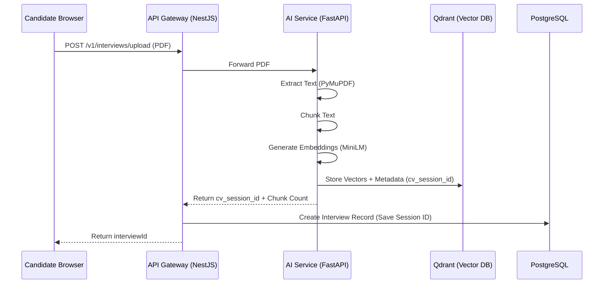
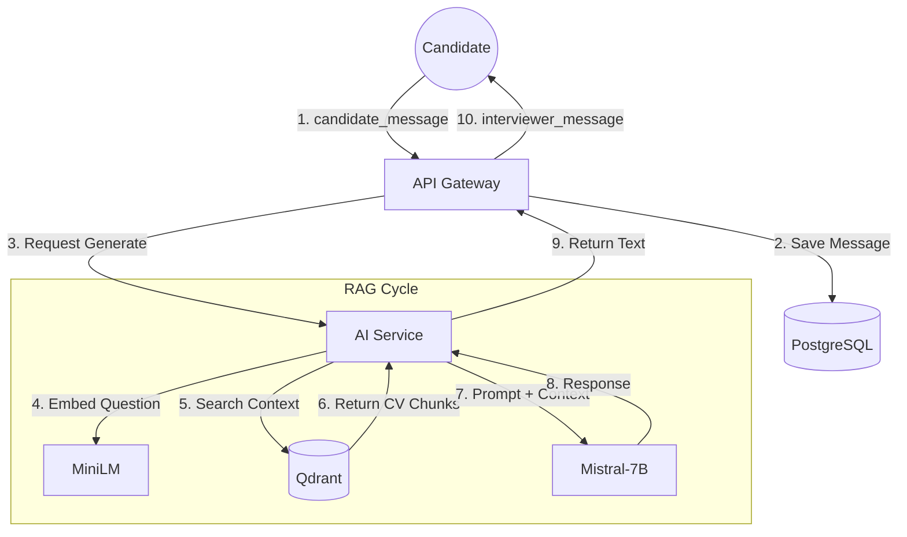

# IntelliView AI - Core Workflows

This document details the technical workflows for the IntelliView AI platform, covering Phase 1 (Core Engine) functionality.

---

## 1. CV Ingestion & Processing Workflow
When a candidate uploads a CV, the system performs the following steps:



1.  **Frontend**: User selects a PDF and clicks "Start Interview".
2.  **API Gateway**: Receives the file via `POST /api/v1/interviews/upload`.
3.  **AI Service**: 
    *   Extracts raw text from the PDF using `PyMuPDF`.
    *   Splits text into logical chunks.
    *   Generates 384-dimensional embeddings for each chunk using `all-MiniLM-L6-v2`.
    *   Stores chunks in **Qdrant** with a `cv_session_id` metadata filter.
4.  **Database**: Gateway creates an `Interview` record and stores the `cv_session_id` in the `rubric` field.

---

## 2. RAG-Based Interview Chat Workflow
The interview interaction is powered by Retrieval-Augmented Generation (RAG) to ensure the AI remains grounded in the candidate's actual experience.



1.  **Candidate Message**: The user sends a message via WebSockets (`candidate_message`).
2.  **Gateway**:
    *   Persists the user's message to PostgreSQL.
    *   Emits `interviewer_typing: true` to the frontend.
    *   Sends a request to the AI Service's `/v1/chat/generate` endpoint.
3.  **AI Service (RAG)**:
    *   **Retrieval**: Embeds the candidate's latest message and searches **Qdrant** for the top 3 most relevant CV chunks (filtered by `cv_session_id`).
    *   **Augmentation**: Injects these chunks into a system prompt defining the technical interviewer persona.
    *   **Generation**: The **Mistral-7B-Instruct** LLM generates a response based on the context and conversation history.
4.  **Gateway**: Receives the generated text, saves it as an 'assistant' message, and emits `interviewer_message` to the client.

---

## 3. Local Development Workflow
The project is containerized but optimized for local speed.

### Initial Setup
```bash
make install    # Install local dependencies for IDE support
make docker-up # Build and start the full stack
```

### Hot-Reloading
*   **AI Service**: Mounted as a volume in Docker. Changes to `backend/ai_service/*.py` trigger an automatic reload of the FastAPI server.
*   **API Gateway**: Mounted as a volume. NestJS runs in watch mode (`npm run start:dev`).
*   **Frontend**: Mounted as a volume. Vite provides Instant HMR (Hot Module Replacement).

### LLM Cache
The Mistral model is downloaded from Hugging Face on the first run. 
*Note: We recommend adding a volume for `~/.cache/huggingface` in docker-compose for persistence across `docker compose down` cycles.*
